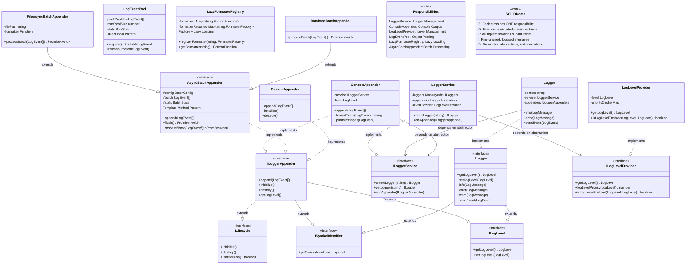

```mermaid
classDiagram
    %% SOLID Architecture Overview for ffs2-logger
    
    %% Core Interfaces (Abstractions)
    class ILogger {
        <<interface>>
        +getLogLevel() LogLevel
        +setLogLevel(LogLevel)
        +info(LogMessage)
        +error(LogMessage)
        +warn(LogMessage)
        +sendEvent(LogEvent)
    }
    
    class ILoggerService {
        <<interface>>
        +createLogger(string) ILogger
        +getLogger(string) ILogger
        +addAppender(ILoggerAppender)
    }
    
    class ILoggerAppender {
        <<interface>>
        +append(LogEvent[])
        +initialize()
        +destroy()
        +getLogLevel()
    }
    
    class ILogLevel {
        <<interface>>
        +getLogLevel() LogLevel
        +setLogLevel(LogLevel)
    }
    
    class ILifecycle {
        <<interface>>
        +initialize()
        +destroy()
        +isInitialized() boolean
    }
    
    class ISymbolIdentifier {
        <<interface>>
        +getSymbolIdentifier() symbol
    }
    
    class ILogLevelProvider {
        <<interface>>
        +getLogLevel() LogLevel
        +logLevelPriority(LogLevel) number
        +isLogLevelEnabled(LogLevel, LogLevel) boolean
    }
    
    %% Concrete Implementations
    class LoggerService {
        -loggers Map~symbol,ILogger~
        -appenders LoggerAppenders
        -levelProvider ILogLevelProvider
        +createLogger(string) ILogger
        +addAppender(ILoggerAppender)
    }
    
    class Logger {
        -context string
        -service ILoggerService
        -appenders ILoggerAppenders
        +info(LogMessage)
        +error(LogMessage)
        +sendEvent(LogEvent)
    }
    
    class ConsoleAppender {
        -service ILoggerService
        -level LogLevel
        +append(LogEvent[])
        +formatEvent(LogEvent) string
        +printMessages(LogEvent)
    }
    
    class AsyncBatchAppender {
        <<abstract>>
        #config BatchConfig
        #batch LogEvent[]
        #stats BatchStats
        +append(LogEvent[])
        +flush() Promise~void~
        +processBatch(LogEvent[])* Promise~void~
    }
    
    class FileAsyncBatchAppender {
        -filePath string
        -formatter Function
        +processBatch(LogEvent[]) Promise~void~
    }
    
    class LogLevelProvider {
        -level LogLevel
        -priorityCache Map
        +getLogLevel() LogLevel
        +isLogLevelEnabled(LogLevel, LogLevel) boolean
    }
    
    class LogEventPool {
        -pool PoolableLogEvent[]
        -maxPoolSize number
        -stats PoolStats
        +acquire() PoolableLogEvent
        +release(PoolableLogEvent)
    }
    
    class LazyFormatterRegistry {
        -formatters Map~string,FormatFunction~
        -formatterFactories Map~string,FormatterFactory~
        +registerFormatter(string, FormatterFactory)
        +getFormatter(string) FormatFunction
    }
    
    %% Interface Composition (Interface Segregation)
    ILoggerAppender --|> ILifecycle : extends
    ILoggerAppender --|> ISymbolIdentifier : extends  
    ILoggerAppender --|> ILogLevel : extends
    ILogger --|> ISymbolIdentifier : extends
    ILogger --|> ILogLevel : extends
    
    %% Dependency Inversion - Depend on Abstractions
    LoggerService ..|> ILoggerService : implements
    LoggerService --> ILogLevelProvider : depends on abstraction
    Logger ..|> ILogger : implements
    Logger --> ILoggerService : depends on abstraction
    ConsoleAppender ..|> ILoggerAppender : implements
    ConsoleAppender --> ILoggerService : depends on abstraction
    AsyncBatchAppender ..|> ILoggerAppender : implements
    FileAsyncBatchAppender --|> AsyncBatchAppender : extends
    LogLevelProvider ..|> ILogLevelProvider : implements
    
    %% Open/Closed Principle - Extension Points
    class CustomAppender {
        +append(LogEvent[])
        +initialize()
        +destroy()
    }
    CustomAppender ..|> ILoggerAppender : implements
    
    class DatabaseBatchAppender {
        +processBatch(LogEvent[]) Promise~void~
    }
    DatabaseBatchAppender --|> AsyncBatchAppender : extends
    
    %% Single Responsibility Principle - Clear Boundaries
    class Responsibilities {
        <<note>>
        LoggerService: Logger Management
        ConsoleAppender: Console Output
        LogLevelProvider: Level Management  
        LogEventPool: Object Pooling
        LazyFormatterRegistry: Lazy Loading
        AsyncBatchAppender: Batch Processing
    }
    
    %% Performance Optimizations - SOLID Compliant
    LogEventPool : Object Pool Pattern
    LazyFormatterRegistry : Factory + Lazy Loading
    AsyncBatchAppender : Template Method Pattern
    
    %% Notes for SOLID Principles
    class SOLIDNotes {
        <<note>>
        S: Each class has ONE responsibility
        O: Extensions via interfaces/inheritance
        L: All implementations substitutable
        I: Fine-grained, focused interfaces
        D: Depend on abstractions, not concretions
    }
```